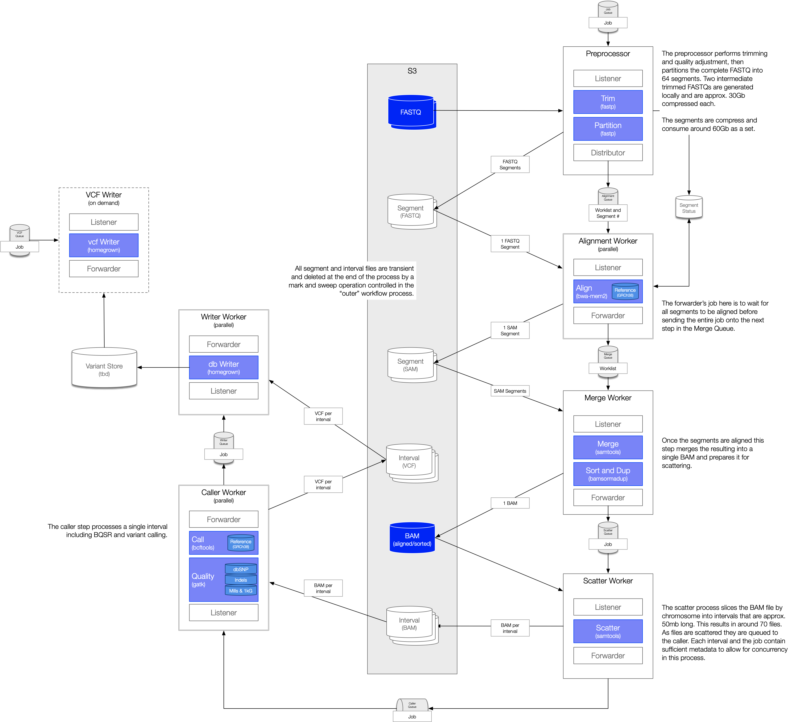

# Notes and thoughts on distributing alignment

See [the supplemental file](experiment.md) for actual timing and file sizes for the commands shown here. The experiment was run on `DPZw_k` which is a 30x Illumina sample. The script that ran the partial experiment is [also available](experiment). `THREAD_COUNT` was set there to 72.

## Alignment

Ok, after having hacked through the alignment process over the weekend I've kinda come to the conclusion that using map/reduce or something like it isn't really the right idea. To make it really work would require an always-on BWA aligner (because of cache and index loading costs) that could listen on some IPC mechanism (probably a socket). I don't think we want to be in the game of forking and maintaining the BWA-MEM2 code (while fun and interesting, unless there's a serious competitive advantage, it's some very gnarly C code hand-tuned by Intel to work very well on their processors and takes explicit advantage of certain processor instruction sets being available)...

So, that leaves us with some other way to perform trimming, alignment, sorting, and duplicate marking (the "alignment" stuff). We can continue to keep a 72 core ec2 running and eat around 120 minutes wall time to get through the above steps. The alternative, and again we're back to figuring out the cost-benefit vs. time-to-align tradeoffs, is to distribute the work in larger chunks.

I took a run at doing a local FASTP trimming operation on the entire FASTQ, then partitioning the file into 64 chunks. The trimming has to happen on the entire FASTQ because of how FASTP determines adapter sequences. There's a chance that different sequences could be identified from different fragments leading to an inconsistent and incorrect alignment. The trimming process is limited to 16 threads (a FASTP limitation) and uses around 1260 wall clock seconds (21 minutes). I then used FASTP again to partition the file by disabling all trimming options (I couldn't successfully combine these two steps, FASTP would simply hang after running for a while) with a clock time of approximately 540 seconds (9 minutes).

```bash
# trim (fastp is limited to 16 threads)
time fastp \
    --in1 /home/ubuntu/stats/FASTQ/DPZw_k_R1.fastq.gz \
    --in2 /home/ubuntu/stats/FASTQ/DPZw_k_R2.fastq.gz \
    --out1=/home/ubuntu/pipeline/parts/DPZw_k_trimmed_R1.fastq.gz \
    --out2=/home/ubuntu/pipeline/parts/DPZw_k_trimmed_R2.fastq.gz \
    --verbose \
    --thread 16 \
    --detect_adapter_for_pe \
    -j /home/ubuntu/pipeline/DPZw_k/DPZw_k-trim-fastp.json \
    -h /home/ubuntu/pipeline/DPZw_k/DPZw_k-trim-fastp.html
```

The intermediate trimmed FASTQ pair can be deleted once the partitioning is completed. There's no real reason to serialize the partitioning operation as each partition pair could be sent to storage and queued to the next operation as soon as the partition is constructed. However, this would require a modification to FASTP because, while it does partition based on the number of assigned threads, there is no way to know that a partition is completed until the entire partioning oepration is complete. This means that the trimming and partioning operations, unless we can address the hang, will take about 1800 seconds (30 minutes) of wall time to execute.

```bash
# split (fastp is limited to 16 threads, disable all quality operations)
time fastp \
    --in1=/home/ubuntu/pipeline/parts/DPZw_k_trimmed_R1.fastq.gz \
    --in2=/home/ubuntu/pipeline/parts/DPZw_k_trimmed_R2.fastq.gz \
    --out1=/home/ubuntu/pipeline/parts/DPZw_k_R1.fastq.gz \
    --out2=/home/ubuntu/pipeline/parts/DPZw_k_R2.fastq.gz \
    --verbose \
    --thread 16 \
    --split 64 \
    --disable_adapter_trimming \
    --disable_trim_poly_g \
    --disable_quality_filtering \
    --disable_length_filtering \
    -j /home/ubuntu/pipeline/DPZw_k/DPZw_k-split-fastp.json \
    -h /home/ubuntu/pipeline/DPZw_k/DPZw_k-split-fastp.html
```

The next step can be parallelized across many worker nodes. In the current experiment run on the "big" ec2 we're using, each partition takes approximately 90 seconds to align. The majority of this time is spent reading the index into memory. We can, and should, use the partition count and the ec2 processor count as input parameters to queueing and service models. It might be the case that dropping the number of partitions, say to 32, would result in a more balanced load / align tradeoff.

```bash
# align the fragments
for i in {1..64}; do
    SEGMENT=$(printf "%.4d" $i)

    time bwa-mem2 mem \
        -t ${THREAD_COUNT} \
        -Y \
        -M \
        -K 720000000 \
        -v 2 \
        -R "@RG\tID:DPZw_k\tPL:ILLUMINA\tPU:unspecified\tLB:DPZw_k\tSM:DPZw_k" \
        /home/ubuntu/reference/Homo_sapiens_assembly38.fasta \
        /home/ubuntu/pipeline/parts/${SEGMENT}.DPZw_k_R1.fastq.gz \
        /home/ubuntu/pipeline/parts/${SEGMENT}.DPZw_k_R2.fastq.gz |
        pigz >/home/ubuntu/pipeline/DPZw_k/DPZw_k.${SEGMENT}.aligned.sam.gz

    rm /home/ubuntu/pipeline/parts/${SEGMENT}.DPZw_k_R1.fastq.gz
    rm /home/ubuntu/pipeline/parts/${SEGMENT}.DPZw_k_R2.fastq.gz
done
```

Once each partition is aligned it can immediately be sent on to be coordinate sorted, duplicate marked, and indexed. This process uses no additional input files and is limited only by the available threads and memory on the sorting node. Each partition in my experiment took about 150 wall clock seconds.

```bash
# sort and mark duplicates
for i in {1..64}; do
    SEGMENT=$(printf "%.4d" $i)

    time unpigz --stdout /home/ubuntu/pipeline/DPZw_k/DPZw_k.${SEGMENT}.aligned.sam.gz |
    bamsormadup \
        SO=coordinate \
        threads=${THREAD_COUNT} \
        level=6 \
        tmpfile=/home/ubuntu/stats/temp/DPZw_k \
        inputformat=sam \
        indexfilename=/home/ubuntu/pipeline/DPZw_k/DPZw_k.${SEGMENT}.sorted.bam.bai \
        M=/home/ubuntu/pipeline/DPZw_k/DPZw_k.${SEGMENT}.duplication_metrics >/home/ubuntu/pipeline/DPZw_k/DPZw_k.${SEGMENT}.sorted.bam
done
```

The final step before we can call variants is to reconstruct the complete aligned and sorted BAM from the individual BAM fragments. Each BAM fragment contains reads from across the genome. We can either scatter the fragment BAMS into intervals (about 64 partitions ⨉ 65 intervals resulting files), or we can recombine the partioning BAMs into a single file and partition after. The experiment I ran over the weekend produces a complete, aligned, sorted BAM (something I believe our customers might ask for) in about 1200 seconds (20 minutes). We would then push this BAM to long term storage for later processing.

```bash
# merge the segments in a single bam per-segment
ls -1 *.bam > bams.lst
time \
    samtools merge -cfp --threads 64 -b bams.lst -f -o - |
    samtools view --threads 64 --bam --write-index --reference /home/ubuntu/reference/covid_reference.fasta --output DPZw_k.sorted.aligned.bam
```

## Variant calling

(This section will use the `chr1:1-50000000` interval as an example.)

Variant calling is inherently parallelizable. Once we have an aligned and sorted BAM we can create intervals of that BAM and run a variant calling process on the individual interval. `samtools` is used to create the interval files and their associated index. This scattering operation uses a different set of input rules but is otherwise configurable (chromosome "sizes" are the fixed input, interval sizes and an overfill factor are used to construct the actual per-interval file sizes). "Scattering" these files is a read-only operation on the source BAM and can be computed in parallel on a single compute node. Our current pipeline performs the interval creation and indexing by starting the process pairs as background jobs and waiting on them to complete. Each interval, run at 4 threads, takes approximately 35 seconds for BAM construction and 3 seconds for index construction. I expect the interval sizes to stay within a fairly small range since each interval is approximately the same size. However, the number of reads within a given interval may differ. (This might be an interesting research paper - what's the relationship to genome position vs. chromosome read distribution vs. coverage alignment)

```bash
# create intervals
time samtools view -@ 4 -bh /home/ubuntu/pipeline/DPZw_k/DPZw_k.sorted.aligned.bam chr1:1-50000000 >/home/ubuntu/pipeline/DPZw_k/DPZw_k.chr1_1_50000000.bam
time samtools index -@ 4 /home/ubuntu/pipeline/DPZw_k/DPZw_k.chr1_1_50000000.bam
```

The way we're calling variants right now (on the single ec2) is to create per-chromosome intervals of 50mbp ±20% and using those individual intervals as inputs to the GATK BQSR process. BQSR is a two-step process which first uses the BAM and various reference data, to construct a table of corrections. Those corrections are then applied to the BAM to create a quality-adjusted BAM. We should run some experiments to determine the value of this step as it's recommended for the GATK "best practices" workflow, but not all experiments use that workflow.

One thing to note about using GATK for the BQSR and variant calling process - GATK is single-threaded. Our current pipeline takes advantage of that by running many BQSR processes in parallel on a single large compute node. I think keeping a smaller cluster of these compute nodes that can run many BQSR processes simultaneously might be a better approach than using many very small nodes. Computing the BQSR table uses around 385 seconds and applying the BQSR to the resulting BAM uses 240 seconds. These processes must be run serially and operate on the same input file. One thing of interest is that the resulting BAM after BQSR application is twice the size of the input BAM.

```bash
# generate BQSR table
time gatk BaseRecalibrator --java-options '-Xmx8g' \
        -R /home/ubuntu/reference/Homo_sapiens_assembly38.fasta \
        -I /home/ubuntu/pipeline/DPZw_k/DPZw_k.chr1_1_50000000.bam \
        -O /home/ubuntu/pipeline/DPZw_k/DPZw_k.chr1_1_50000000_bqsr.bam.table \
        --verbosity ERROR \
        --preserve-qscores-less-than 6 \
        --known-sites /home/ubuntu/reference/Homo_sapiens_assembly38.dbsnp138.vcf \
        --known-sites /home/ubuntu/reference/Homo_sapiens_assembly38.known_indels.vcf \
        --known-sites /home/ubuntu/reference/Mills_and_1000G_gold_standard.indels.hg38.vcf \
        -L chr1:1-50000000

# apply BSQR
time gatk ApplyBQSR --java-options '-Xmx8g' \
    -R /home/ubuntu/reference/Homo_sapiens_assembly38.fasta \
    -I /home/ubuntu/pipeline/DPZw_k/DPZw_k.chr1_1_50000000.bam \
    -O /home/ubuntu/pipeline/DPZw_k/DPZw_k.chr1_1_50000000_bqsr.bam \
    --verbosity ERROR \
    --emit-original-quals true \
    --preserve-qscores-less-than 6 \
    --static-quantized-quals 10 \
    --static-quantized-quals 20 \
    --static-quantized-quals 30 \
    --bqsr-recal-file /home/ubuntu/pipeline/DPZw_k/DPZw_k.chr1_1_50000000_bqsr.bam.table \
    -L chr1:1-50000000

# index the resulting file
time samtools index -@ 4 /home/ubuntu/pipeline/DPZw_k/DPZw_k.chr1_1_50000000_bqsr.bam
```

Each resulting quality-adjusted BAM is then passed to one of the variant calling operations (both are options to our pipeline): `bcftools mpileup`/`bcftools call` or `HaplotypeCaller`.

The `bcftools` caller has an option to specify the number of threads however that option is either ignored or doesn't work as defined. The calling process is single threaded. We currently run `mpileup` and pipe its output directly to `call` to reduce both the overall time and the temporary disk space needed. Variant calling is one of the most time-wise expensive operations. The pileup operation uses 100% of a single core while running and the linked call operation uses < 10%. Overall variant calling runs in about 360 seconds (6 minutes) per interval.

```bash
# call variants
time bcftools mpileup \
        --annotate FORMAT/AD,FORMAT/DP,FORMAT/QS,FORMAT/SCR,FORMAT/SP,INFO/AD,INFO/SCR \
        --max-depth 250 \
        --no-BAQ \
        --threads 64 \
        --output-type u \
        --regions chr1:1-50000000 \
        --fasta-ref /home/ubuntu/reference/Homo_sapiens_assembly38.fasta \
        /home/ubuntu/pipeline/DPZw_k/DPZw_k.chr1_1_50000000_bqsr.bam 2>/dev/null | \
    bcftools call \
        --annotate FORMAT/GQ,FORMAT/GP,INFO/PV4 \
        --variants-only \
        --multiallelic-caller \
        --ploidy GRCh38 \
        --threads 64 \
        --output-type v  \
        --output /home/ubuntu/pipeline/DPZw_k/DPZw_k.chr1_1_50000000.vcf 2>/dev/null
```

## Alignment approach

The following describes most of what's shown on this diagram. The exception is the "writer worker" and "vcf writer". They are mentioned in the description, but I didn't go into all the detail they demand. This process starts at the top-right with the receipt of a FASTQ processing request (a sample and a pointer to the associated paired-end Illumina FASTQ files).



Given the above I think we need to construct a repeatable workflow (I'm hesitant to use that term, but...) that listens for an inbound FASTQ alignment job consisting of { sample, FASTQ location, job parameters } which then starts the above processing. The listener process would schedule the FASTQ trimming and partitioning on one of the medium-sized partitioning nodes (because FASTP is CPU-limited to 16 threads). Each partition FASTQ pair would be written to S3 and we'd record execution metrics in addition to the FASTP quality reports.

That pre-process step would perform trimming and partitioning then schedule the alignment processing for each individual partition. The alignment process `bwa-mem2` is capable of using multiple / all CPUs on a given node and the more available the faster it'll run. The alignment nodes would read their individual gzipped partition FASTQ pair and generate a single gzipped and aligned SAM. We'd then write the SAM to S3 and store the execution data (we'll probably want to write a BWA output scraper to grab additional execution data).

As each of the alignments are completed and the FASTQ pairs are written to S3 a sorting and duplicate marking job can be scheduled. That job pulls the individual SAM from S3 sorts and duplicate marks it and writes the resulting BAM back to S3. `bamsormadup` is also capable of using all CPUs on a node and behaves well up to the 72 core node that I've been using.

The next step requires some additional coordination as the overall workflow is blocked until all partitions are aligned and sorted. Those partitions serve as input to the merge operation that's used for creating the individual interval files. Some process (it could be an "outer" workflow that's watching the job or it could be the sorting node) will be responsible for noting that the last partition is complete and in S3 so that the merge and interval-generation process can begin. That process pulls the BAM from S3 and the interval configuration data from the job to create the intervals over which we'll apply calibration and call variants. Each interval generates two files (or the calibration node can pull the interval and generate the interval it needs) - the BAM and an index.

Calibration operates on the aligned and sorted interval and generates another BAM as a result. These two processes must run sequentially and both are single-threaded. They both use several reference files which should be staged (including the reference file indexes and trees) locally instead of pulling them from storage (they're large and the time to pull will be close to the execution time). Each partition runs independently of the others and the resulting BAM is then pushed into S3.

The final step before variant post-processing is to actually call the variants. This step also requires access to the reference data (the reference genome FASTA and variant index files), and is also single-threaded. See below for how we might conclude the workflow.

## Variant post-processing

We have a number of alternatives for post-call variant processing. My preferred model is to send each interval variant set to a process that reads the VCF and stores the resulting variant data on a per-position basis in a relational store. This option gives us a queryable database (using technology that we are all comfortable with) in which we can perform downstream variant analysis (searching, joining to known annotation stores, reconstructing full or partial VCF files).

The above experiment resulted in 80436 variants found in the target interval. Of that we would want to store (sample, chrom, pos, alt, qual) along with some of the `INFO` data (read depth, allele depth, quality attributes, and some other data). The additional data might be best stored in an inverted index of (name, value) pairs unless we have a fixed set that we always capture. In that case we would promote those into the primary variant table and keep the inverted index for "extension" data.

Another alternative is to recombine all of the interval VCFs into a per-sample file and store that. Querying over the resulting VCF would require specialized storage models andq query languages. We could store the VCF long term and deliver it as-is to a customer or perform a just-in-time variant annotation and deliver that file. We might also perform the variant annotation and store that resulting VCF are our query target. However, we're back to the problem of having a specialized query language and storage model, plus we add in a staleness factor for later variant interpretation. That is, we would need to either be content that our annotations have a valid-at timestamp or be open to running an analysis followed by a "refresh" annotation. Again, my preference is to store this in a way that we can get current analysis and generate VCFs on an ad hoc basis. (We could also get tricky and version our annotation data so that it would be possible to "go back in time" to generate a VCF from a known reference set.)