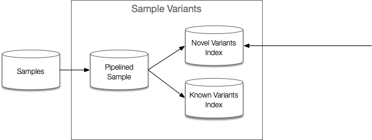
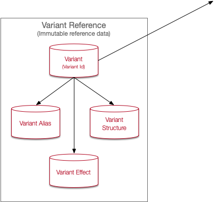
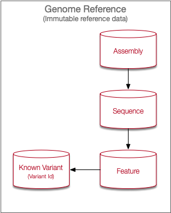

Right now I'm just going to try to capture the random design thoughts that are running around on scraps of paper. There are a number of interesting design decisions to make and none are really driven by hard requirements. Most of this document is randomly ordered.

## Notes

- Each reference assembly requires its own storage subsystem
- A storage subsystem holds
  - The base reference assembly structure (sourced from the GFF)
    - A means to query into that structure using
      - ( sequence id, locus )
      - ( sequence id, start locus, stop locus )
      - feature name (gene, gene feature, coding/non-coding transcript, protein)
  - The known variants sourced from NCBI
  - The known variant impact (for annotation) where available
  - The output from processing the input sequence data (in FASTQ format)
    - Processing metadata / state
    - Source FASTQ (pairs)
    - Aligned / sorted BAM
    - Optionally, and short-term, the VCF
  - A means to "join" the known variants with the sample variants
  - An API that provides a means to
    - Start / stop / reflect over a sequence pipeline
    - Request sequence outputs in various forms: VCF, BAM, CRAM, FASTQ
    - Query reference assembly structure(s)
    - Query sequence data by sequence
    - Query sequence data across sequences

## Query paths

- Search for samples by variant
- Search for count of samples by variant
- Search variants
  - By name
  - By locus
  - By ClinVar / genomic taxonomy
  - By gene / gene component
- Find all variants / generate VCF for sample
- Search for variant effect (annotate)

If someone asks "does this sample have this variant" we would find the variant and find the sample in parallel, then using the variant ID ask the sample (via its variant index block) if the corresponding bit is set.

For the case where someone asks "does this sample have a variation at {chromosome, locus}" and that is an unknown variant we need a different index. This would require being able to locate that `{chromosome, locus}` within the sample's data somewhere (BAM, some other index, a graph... either way this is a big data structure). One way to solve this is to capture novel variants in an identical structure to the known variants store but keep that novel variant store current as we discover new variants. In this case it's a fallback to the same logic against a different store. This case really shows up where we have novel structural variants and none of the above stores really solve that problem.

One thought might be to store a data structure that's very close to a VCF but without all the redundant information and only storing structural variants. This file could be quite large but the data structure might fit an interval tree. We migth store insertions and deletions differently. A deletion, for example, might be as simple as storing a `{locus, length}` describing where the deletion begins and the number of bases removed. An insertion might be `{locus, bases}` showing what new bases are inserted at a given locus. An indel is a different story. Would we consider CIGAR format here?

## Sources

This is just a list of interesting links that I'm using as references

- [https://github.com/The-Sequence-Ontology/Specifications/blob/master/gvf.md](Genome Variation Format 1.10) defines known variants
- [https://www.ncbi.nlm.nih.gov/datasets/docs/v1/reference-docs/file-formats/about-ncbi-gff3/](GFF3 format) defines a reference assembly / sequence structure
- [https://www.insdc.org/files/feature_table.html#7.2](The DDBJ/ENA/GenBank Feature Table Definition) provides detailed breakdown of the NCBI structures that map onto the GFF file

## APIs and services

In general any query into the digital biobank will result in multiple queries across the various services and stores that comprise a given biobank. The APIs for the biobank sit at the edge and rely on instances of the below services to fulfill client requests. A client should not have to make multiple requests which might expose the inner details of this service group. A good way to think about an instance of a digital biobank is as a set of coordinating services, their reference data, their transactional / operational data, and the APIs that allow one to access the biobank.

{width=50%}

The sample variants store is a multi-level structure. At the top is a table of samples and their aliases (alternate key on BBID). Each sample undergoes a pipeline operation to produce the set of known and unknown variants. Each pipelined sample has an associated SQLite database holding the Variant Id sets for known and novel variants. Other pipeline results will be stored in S3 (or other mass storage).

{width=50%}

The novel variant store contains the structural elements of unknown variants (those not present in the Variant Reference). The data structures here are similar to the Variant Reference but lack the aliasing and effect data. This data is Ovation-owned IP. Because the structure is similar to the Variant Reference this will also be RDS-based Postgres. As novel variants are discovered they are added to this store. Existing novel variants are linked to any sample with that variant.

{width=50%}

The Variant Reference is a simple API and storage system. It’s rather large, but immutable and can be structured for fast query. This can be an RDS-based Postgres database. Because the variant structures are keyed off the Genome Reference coordinates, there should be a schema / database per variant reference.

The Genome Reference is a simple API and storage system. There is little need to replicate this, and given its size and structure (range-based indexing) it should fit nicely in an RDS-based Postgres database. Each reference would have its own schema / database.

{width=50%}

Each known variant will carry a (to be determined) 64k bitmap where each bit corresponds to a sample carrying that variant. This is preliminary and requires experimentation. We might use 16kb bitmaps and shard them across multiple columns so that the number of variant-carrying samples can be increased over time. This set of structures behaves much like a sharded key / value store.

## Other notes

For sample-centric storage we'll want to be able to find all variants (novel and known). We might consider storing simply a compressed list of _variant id_ for the known variants, but a detailed representation for novel variants. However, once we uncover a matching novel variant in a second sample we'll want to promote the novel variant structure to "semi known variant", assign it an ID, and link the existing samples. Should each sample "point to" a file on disk that stores an independent (b\*tree?) structure with the known variants and a second structure that indexes into the novel variant store (also a b\*tree)?

### Variant identification

For storage on the variant side we'll either get a well-known name for a variant (a locus, clinvar alias, hgvs name) so that we can query through to the samples, or we'll get a "variant expression" (sequence_id, start, stop, allele) so that we can query into novel variants. We're looking for number of matching samples or the samples themselves. One outstanding question is whether we need boolean operators (AND, OR, NOT) such that a number of variants might be matched and the results joined.

## Storage notes

The below describe some of the data structures supporting the above query paths.

### Sample-variant index

Assume somewhere around 8 million variants per sample (yes, this is extremely high right now) we can use a 64k page size to hold the variant ID block data. Using 16 pages at 64k (and ignoring any per-page housekeeping) gives us around 8,388,608 variant IDs per sample. There's a problem with this approach though - the number of possible variants, given the NIH/NBCI dataset is nearly 3 orders larger (around 1 billion) than the 1k genome project's dataset (4.5 million). That could require on the order of 2000 pages (1,053,471,122 variants at 524,288 per page), nearly all of which will be empty. Keeping a per-sample index lookup could alleviate this by providing a means to determine which pages are dirty and which are not. As with the variant store below we might keep a smaller list of variants in a block by their ID instead of by bitmap until the block exceeds some size. In many cases (how many?) the number of variants in a block will be small; on average 2250 (4,500,000 variants over 2000 pages), but the variance might be high given some chromosomes have a larger number of identified variants and are physically larger.

Mapping from sample to variant could use a very dirty model of a SQLite database per sample with a simple table of variant IDs. Doing so removes any need for custom algorithms on our part as we reference and load the on-disk "database" and query it as needed. Assuming a variant ID is 8 bytes and row overhead is about 10% this might use about 40mb. The assumption here is that we can reconstruct the VCF based on the reference and the variant information. If we need to store read depth per variant we'll need to increase the size by 1 byte per variant (assuming we can cap read depth at 255).

Constructing a VCF, complete or interval, from a sample would require loading each page, in order, to identify the called variants (those with a 1 bit at the variant index). That variant ID set would be sent downstream to read the variants from the variant store and optionally assign annotations. Each variant would be returned and the result would be coordinate sorted and written to a file.

### Variant-sample index

This one is a little easier to scope for now. We can again take a 64k page size to hold the sample ID block data. Ignoring a small housekeeping overhead per page (approximately 8 bytes to hold the page number and the current count of samples with that variant in that page) we can hold around 524,244 sample IDs per page. We would also keep a per-variant document describing the number of sample blocks for that variant.

Note that this results in a very sparse index because a "later" sample (one with a higher ID) could carry a given variant that no other samples have, which would result in at least one block.

The NIH/NCBI known variants database (see below) has just over 1 billion entries. Assuming each entry has at least one associated sample we quickly end up "this isn't going to work" space. Given how sparse the matrix is using bitmap pages might be wasteful. One alternative here is to simply keep the list of sample IDs until that list exceeds some fixed size (at 64k for a block, ignoring housekeeping, we could store some 16,000 samples with that variant). We might also look at the variant's known frequency in the population and dynamically choose a storage algorithm. A simple database table of `{ variant ID, sample ID }` as a cross-reference might work for rare variants since we wouldn't add them to the table until we see them and the number of associated samples, by definition, would be small. Making this lookup dynamic will incur a small query cost to evaluate the storage model and select an algorithm, but this cost may be small compared to the overall query cost.

Finding the samples that exhibit a given variant would require iterating the sample block to create the sample ID set. Alternatively the samples service described above might accept a block and offset as an input and construct the sample ID set itself. This set of samples would result in a set of patient identifiers which would be sent to the Living Lab patient service (or sample BBID?) to return patient phenotypic and clinical data.

### The reference genome structure(s)

This store is actually the easiest to implement using commercial tech. A natural structure allowing for both single coordinate lookup (chromosome, offset) or ranged lookup (chromosome, start, stop) is an interval tree. This repo has a script that reads a GFF and stores all features in an interval tree. Example queries, on my OLD 8 core 16Gb MacBook show results in the sub-0.1 second range for both single and ranged queries. To identify the locus or range we would convert the requested variant / gene / feature into HGVS genome format and pass that as an input to the feature store. We can also reverse that process by passing in a locus or range and getting back the set of "touched" features with their HGVS names.

```sql
create table genome_features (
    sequence_id character varying(20),
    feature_type character varying(100),
    start_position int,
    stop_position int,
    id character varying(200),
    name character varying(200),
    description character varying(200),
    gene character varying(200),
    start_key bigint,
    stop_key bigint,
    local_region int4range,
    global_region int8range
);
```

### The variant definition structure

This is another easy structure to store as this is mainly a lookup over `HGVS`, `gene`, `RSID`, and `{sequence, position, alt}`. We'll want to keep a mapping over those keys to our own variant ID so that an update to the variant reference store could be a simple database reload. If so then we simply need to find those keys that are unmapped (new) or no longer mapped (removed) to keep them in sync. An `HGVS` is just a readable representation of a genomic position and ref->alt change so that data is redundant with the `{sequence, position, alt}` + `variant_type`.

```sql
create table variant_reference (
    sequence_id character varying(20),
    position integer,
    ref text,
    alt text,
    hgvs character varying(8192),
    variant_type character varying(100),
    common boolean,
    gene_info character varying(8192),
    rs integer
);
```

### Other notes

The following appear to be expensive operations, however the CSA-based operations are extremely fast and easy to code in C, and the other "compute intensive" operations are dominated by the page load time (we _might_ consider a distributed network of index nodes and load those off local disk, EBS, or from memory instead of pulling a page off S3)

- Calculate the number of samples with a variant: for each sample block associated with variant, load block, extract bits_set field or apply parallel CSA to count bits (each block can be parallelized)
- Add a sample to a variant: compute the sample bit position, compute the variant block identifier, acquire lock(s), load block, set bit position and update bits_set, write block, release lock(s); multiple locks may be necessary if the variant block metadata must be updated to add a new block;
- Calculate the number of variants a given sample has: for each varint block associated with sample, load block, extract bits_set or apply parallel CSA to count bits (each block can be parallelize)
- Determine if sample has variant: convert variant into bit position, compute block holding bit position, load block, compute offset by shifting out block number and variants per block, pull word from block, compute remainder and mask
- Adding a variant to a sample: this should not occur outside of the processing of a sample itself where entire blocks can be constructed (which argues that our variant processing should include an internal annotation step to write our variant ID)
- Building the genome feature requires reading the genome [FASTA and GFF](https://www.ncbi.nlm.nih.gov/assembly/GCF_000001405.40/) using feature_reader to construct the temporary structures which are then loaded into postgres and indexed (this is about a 5 minute operation end-to-end)
- Building the variant database required parsing the ["known sites"](https://ftp.ncbi.nih.gov/snp/latest_release/VCF/) data into a temporary structure (this takes many hours and many Gb of disk space), then loading it into postgres and indexing. Parsing the VCF into an intermediate form takes about 5 hours and about 55Gb of temporary storage. Loading that intermediate form into postgres takes about an hour. Indexing takes an additional (TODO, first part takes 90 minutes, second about 20, third about 80 minutes) A query over the reference variants shows the following results. In this case "common" is defined as "A common SNP is one that has at least one 1000Genomes population with a minor allele of frequency >= 1% and for which 2 or more founders contribute to that minor allele frequency."

  ```
  +--------+------------+
  | common | count      |
  |--------+------------|
  | False  | 1032315151 |
  | True   | 21155971   |
  +--------+------------+
  ```

<!--
  pandoc -o design-notes.pdf -f markdown+inline_notes+yaml_metadata_block+fancy_lists --standalone -t latex design-notes.md
-->
